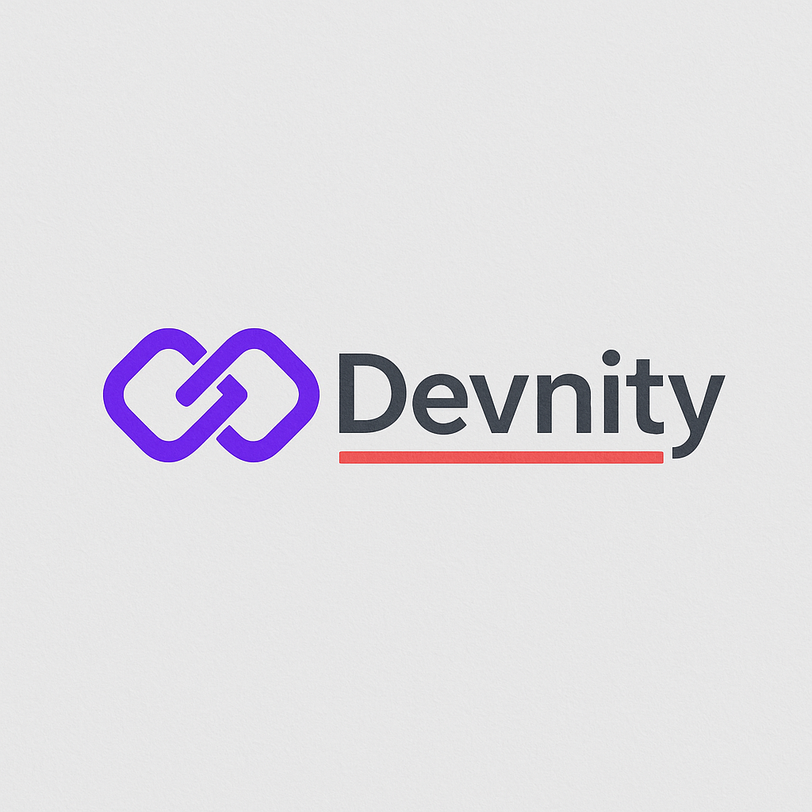

# Devnity - Sistema de Gestão Empresarial



## 🚀 Sobre a Devnity

A Devnity é uma empresa de desenvolvimento de software que se destaca como parceira estratégica na criação de soluções tecnológicas personalizadas e autênticas. Combinamos expertise técnica de ponta com uma abordagem colaborativa e transparente, garantindo não apenas a entrega de sistemas inteligentes e escaláveis, mas também um crescimento conjunto e resultados mensuráveis que impulsionam sua empresa para o futuro.

### 🎯 Missão
Transformar desafios empresariais em soluções tecnológicas personalizadas e inovadoras, impulsionando o crescimento e a eficiência de nossos clientes através de parcerias estratégicas e excelência técnica.

### 🔮 Visão
Ser reconhecida como a principal parceira de inovação tecnológica, líder na criação de sistemas sob medida que redefinem o potencial de negócios e promovem um impacto positivo e duradouro na sociedade.

### 💎 Valores

#### 💡 Inovação Contínua
Estamos em constante busca pelo novo, explorando o desconhecido e experimentando com propósito. Acreditamos que a evolução tecnológica é um caminho sem fim, e nós evoluímos junto com ela.

#### ⚙️ Excelência Técnica e Segurança
Nosso compromisso é com a entrega de sistemas robustos, confiáveis e seguros. Valorizamos o código limpo, escalável e eficiente, aplicando as melhores práticas da indústria.

#### 🤝 Colaboração, Transparência e Honestidade
Construímos relações sobre a base da confiança mútua e comunicação clara. A transparência e honestidade são essenciais em todas as nossas interações.

#### 🚀 Foco no Resultado e Crescimento Conjunto
Cada solução desenvolvida tem um propósito: gerar impacto real e valor mensurável. Nosso objetivo é resolver problemas complexos e transformar desafios em vantagens competitivas.

#### 🧬 Evolução Constante
Estamos sempre aprendendo, nos desafiando e aprimorando nossos processos, nossa equipe e nossas entregas.

## 🎨 Design System

### Paleta de Cores

#### Cores Primárias
- **Devnity Primary**: `#3B82F6` (Modern Blue)
- **Devnity Secondary**: `#6366F1` (Indigo)
- **Devnity Accent**: `#10B981` (Emerald)

#### Cores de Sistema
- **Success**: `#22C55E` (Green)
- **Warning**: `#FB923C` (Orange)
- **Error**: `#EF4444` (Red)

#### Paleta Neutra
- **Gray 50**: `#F9FAFB`
- **Gray 100**: `#F3F4F6`
- **Gray 200**: `#E5E7EB`
- **Gray 300**: `#D1D5DB`
- **Gray 400**: `#9CA3AF`
- **Gray 500**: `#6B7280`
- **Gray 600**: `#4B5563`
- **Gray 700**: `#374151`
- **Gray 800**: `#1F2937`
- **Gray 900**: `#111827`
- **Gray 950**: `#030712`

### Tipografia
- **Font Family**: Inter (Sans-serif principal)
- **Font Mono**: JetBrains Mono (Para código)

### Classes Utilitárias Personalizadas

#### Gradientes
```css
.devnity-gradient /* Gradiente primário */
.devnity-gradient-hover /* Gradiente para hover */
.devnity-text-gradient /* Texto com gradiente */
```

#### Efeitos
```css
.devnity-glass /* Efeito glassmorphism */
.devnity-card /* Card com hover suave */
.devnity-button-primary /* Botão primário da marca */
```

#### Animações
```css
.devnity-animate-in /* Animação de entrada */
.devnity-animate-pulse /* Pulso customizado */
```

## 🏗️ Estrutura do Sistema

### Tecnologias Utilizadas
- **Backend**: Laravel 11
- **Frontend**: Vue.js 3 + TypeScript
- **Styling**: Tailwind CSS 4
- **Build Tool**: Vite
- **Database**: SQLite (desenvolvimento)

### Estrutura de Arquivos
```
devnity/
├── app/
│   ├── Http/Controllers/    # Controladores
│   ├── Models/             # Modelos Eloquent
│   └── Http/Requests/      # Form Requests
├── resources/
│   ├── js/
│   │   ├── Layouts/        # Layouts Vue
│   │   ├── pages/          # Páginas da aplicação
│   │   └── components/     # Componentes reutilizáveis
│   └── css/
│       └── app.css         # Estilos principais
└── public/
    └── images/             # Recursos visuais
```

## 🚀 Funcionalidades

### Sistema de Clientes
- ✅ Cadastro completo de clientes (PF/PJ)
- ✅ Filtros avançados e busca
- ✅ Exportação de dados em CSV
- ✅ Validação de CPF/CNPJ
- ✅ Interface responsiva

### Gestão de Projetos
- 🔄 Em desenvolvimento
- Controle de projetos de desenvolvimento
- Timeline e marcos
- Alocação de recursos

### Propostas Comerciais
- 🔄 Planejado
- Geração de propostas
- Aprovação e assinatura digital
- Controle de pipeline

### Central de Suporte
- 🔄 Planejado
- Sistema de tickets
- Base de conhecimento
- Chat em tempo real

## 🎯 Diferenciais da Plataforma

### 🎨 Design Moderno e Profissional
- Interface clean e intuitiva
- Design system consistente
- Modo escuro/claro
- Responsivo e acessível

### ⚡ Performance Otimizada
- Carregamento rápido
- Navegação fluida
- Otimizações de bundle
- Cache inteligente

### 🔒 Segurança Avançada
- Autenticação robusta
- Validação de dados
- Proteção CSRF
- Sanitização de inputs

### 📱 Experiência Mobile-First
- Design responsivo
- Touch-friendly
- Offline-ready (planejado)
- PWA capabilities

## 🛠️ Instalação e Configuração

### Pré-requisitos
- PHP 8.2+
- Node.js 18+
- Composer

### Passos de Instalação

1. **Clone o repositório**
```bash
git clone https://github.com/LeandroLDomingos/devnity.git
cd devnity
```

2. **Instale as dependências**
```bash
composer install
npm install
```

3. **Configure o ambiente**
```bash
cp .env.example .env
php artisan key:generate
```

4. **Execute as migrações**
```bash
php artisan migrate
php artisan db:seed
```

5. **Compile os assets**
```bash
npm run dev
```

6. **Inicie o servidor**
```bash
php artisan serve
```

## 🎨 Guia de Estilo de Código

### Princípios de Design

#### 1. **Simplicidade**
- Interfaces limpas e desobstruídas
- Foco no conteúdo essencial
- Navegação intuitiva

#### 2. **Consistência**
- Padrões visuais uniformes
- Comportamentos previsíveis
- Terminologia consistente

#### 3. **Acessibilidade**
- Contraste adequado
- Navegação por teclado
- Suporte a leitores de tela

#### 4. **Performance**
- Carregamento otimizado
- Animações suaves
- Responsividade fluida

### Componentes Padrão

#### Botões
```vue
<!-- Botão primário -->
<button class="devnity-button-primary">
  Ação Principal
</button>

<!-- Botão secundário -->
<button class="px-4 py-2 border border-gray-300 dark:border-gray-600 rounded-lg hover:bg-gray-50 dark:hover:bg-gray-800 transition-colors">
  Ação Secundária
</button>
```

#### Cards
```vue
<div class="devnity-card p-6">
  Conteúdo do card
</div>
```

#### Formulários
```vue
<input class="w-full px-3 py-2 border border-gray-300 dark:border-gray-600 rounded-lg bg-white dark:bg-gray-800 text-gray-900 dark:text-gray-100 focus:ring-2 focus:ring-blue-500 focus:border-transparent">
```

## 📈 Roadmap

### Q1 2025
- [x] Sistema de autenticação
- [x] Gestão de clientes
- [x] Design system base
- [ ] Gestão de projetos básica

### Q2 2025
- [ ] Sistema de propostas
- [ ] Central de suporte
- [ ] Dashboard analytics
- [ ] Integração com APIs externas

### Q3 2025
- [ ] App móvel
- [ ] Assinatura digital
- [ ] Relatórios avançados
- [ ] Automações

### Q4 2025
- [ ] IA para insights
- [ ] Marketplace de integrações
- [ ] API pública
- [ ] Sistema de parceiros

## 🤝 Contribuindo

Acreditamos no poder da colaboração! Para contribuir:

1. Fork o projeto
2. Crie uma branch para sua feature (`git checkout -b feature/AmazingFeature`)
3. Commit suas mudanças (`git commit -m 'Add some AmazingFeature'`)
4. Push para a branch (`git push origin feature/AmazingFeature`)
5. Abra um Pull Request

## 📄 Licença

Este projeto está licenciado sob a MIT License - veja o arquivo [LICENSE.md](LICENSE.md) para detalhes.

## 📧 Contato

**Devnity Development Solutions**
- Website: [devnity.com](https://devnity.com)
- Email: contato@devnity.com
- LinkedIn: [/company/devnity](https://linkedin.com/company/devnity)

---

<div align="center">

**"Na Devnity, a inovação não é apenas um conceito, mas uma prática diária que nos permite entregar soluções digitais que realmente fazem a diferença."**

Feito com ❤️ pela equipe Devnity

</div>
